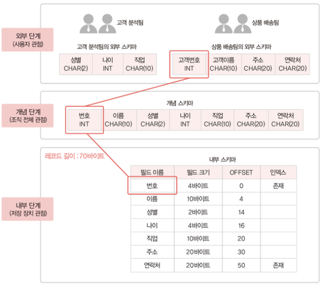

# 03. 데이터베이스 시스템

### 데이터베이스 시스템 개요

- 데이터베이스 시스템: 데이터베이스에 데이터를 저장하고, 이를 관리하여 조직에 필요한 정보를 생성해주는 시스템

### 스키마와 인스턴스

- **스키마(schema)**
    - **데이터베이스에 저장되는 데이터 구조와 제약조건에 관한 전반적인 명세를 기술한 메타데이터의 집합**
    - 쉽게 말해 DB 내에 어떤 구조로 데이터가 저장되는가를 나타낸 것
    - 데이터 사전에 저장되며, 메타데이터(데이터를 위한 데이터) 라고도 함
    - 사용자의 관점에 따라 외부 스키마, 개념 스키마, 내부 스키마로 나뉨
        - **외부 스키마(external schema)**
            - 외부 단계에서 사용자에게 필요한 데이터베이스를 정의한 것
            - 각 사용자가 생각하는 데이터베이스의 모습, 즉 논리적 구조로 사용자마다 다름
            - 서브 스키마(sub schema)라고도 함
        - **개념 스키마(conceptual schema)**
            - 개념 단계에서 전체 데이터베이스의 논리적 구조를 정의한 것
            - 조직 전체의 관점에서 생각하는 데이터베이스의 모습
                - 모든 응용 프로그램이나 사용자들이 필요로하는 데이터를 종합한 조직 전체의 데이터베이스
            - 전체 데이터베이스에 어떤 데이터가 저장되는지, 데이터들 간에는 어떤 관계가 존재하고 어떤 제약조건이 있는지에 대한 정의뿐만 아니라, 데이터에 대한 보안 정책이나 접근 권한에 대한 정의도 포함
            - 하나의 데이터베이스에 하나만 존재
        - **내부 스키마(internal schema)**
            - 전체 데이터베이스가 저장 장치에 실제로 저장되는 방법을 정의한 것
            - 레코드 구조, 필드 크기, 레코드 접근 경로 등 물리적 저장 구조를 정의
            - 하나의 데이터베이스에 하나만 존재
- **인스턴스(instance)**
    - 스키마에 따라 데이터베이스에 실제로 저장된 값

### 3단계 데이터베이스 구조

- 하나의 데이터베이스를 관점에 따라 세 단계로 나눈 것
- **외부 단계**
    - 데이터베이스를 **개별 사용자 관점**에서 이해하고 표현하는 단계
    - 하나의 데이터베이스에 외부 스키마가 여러개 존재할 수 있음
- **개념 단계**
    - 데이터베이스를 **조직 전체의 관점**에서 이해하고 표현하는 단계
    - 하나의 데이터베이스에 하나의 개념 스키마만 존재할 수 있음
- **내부 단계**
    - 데이터베이스를 저장 장치의 관점에서 이해하고 표현하는 단계
    - 하나의 데이터베이스에 하나의 내부 스키마만 존재할 수 있음

### 3단계 데이터베이스 구조의 사상(Mapping)

- 데이터베이스를 3단계 구조로 나누고 단계별로 스키마를 유지하며 스키마 사이의 대응 관계를 정의함
    - **외부/개념 사상**: 외부 스키마와 개념 스키마의 대응 관계
        - 응용 인터페이스(application interface) 라고 함
    - **개념/내부 사상**: 개념 스키마와 내부 스키마의 대응 관계
        - 저장 인터페이스(storage interface) 라고 함

- 미리 정의된 사상 정보를 이용해 사용자가 원하는 데이터에 접근
- **데이터 독립성의 실현**을 위해 단계별로 스키마를 유지하며 스키마 사이의 대응 관계를 정의
    - **데이터 독립성**: 하위 스키마를 변경하더라도 상위 스키마가 영향을 받지 않는 특성
        - **논리적 데이터 독립성**
            - 개념 스키마가 변경되어도 외부 스키마는 영향을 받지 않음
            - 관련된 외부/개념 사상만 정확하게 수정하면 됨
        - **물리적 데이터 독립성**
            - 내부 스키마가 변경되어도 개념 스키마는 영향을 받지 않음
            - 관련된 개념/내부 사상만 정확하게 수정하면 됨
- 단계별 스키마를 연결하는 인터페이스와 같은 개념이라고 이해함

### 기타 스키마와 관련된 용어

- **데이터 사전(data dictionary)**
    - 데이터베이스에 저장되는 데이터에 관한 정보, 즉 메타 데이터를 유지하는 시스템 데이터베이스
    - 스키마, 사상 정보, 다양한 제약조건 등을 저장
    - 일반 사용자도 접근 가능하지만, 저장 내용을 검색만 할 수 있음
- **데이터 디렉토리(data directory)**
    - 데이터 사전에 있는 데이터에 실제로 접근하는데 필요한 위치 정보를 저장하는 시스템 데이터베이스
    - 일반 사용자는 접근 불가
- **사용자 데이터베이스(user database)**
    - 사용자가 실제로 이용하는 데이터가 저장되어 있는 일반 데이터베이스
    

### 데이터베이스 사용자

- 데이터베이스를 이용하기 위해 접근하는 모든 사람
    - **데이터베이스 관리자(DBA; Database Administrator)**
        - 데이터베이스 시스템을 운영 및 관리
        - 주로 데이터 정의어와 데이터 제어어 이용
    - **최종 사용자(end user)**
        - 데이터베이스에 접근하여 데이터를 조작(삽입, 삭제, 수정, 검색)하는 사람
        - 주로 데이터 조작어 이용
    - **응용 프로그래머(application programmer)**
        - 데이터 언어를 삽입하여 응용 프로그램을 작성하는 사람
        - 주로 데이터 조작어 이용

### 데이터 언어

- 사용자와 데이터베이스 관리 시스템간의 통신수단
    - **데이터 정의어(DDL; Data Definition Language)**
        - 스키마를 정의하거나, 수정 또는 삭제하기 위해 사용
        - `create database`, `create table` 등
    - **데이터 조작어(DML; Data Manipulation Language)**
        - 데이터의 삽입, 삭제, 수정, 검색 등의 처리를 요구하기 위해 사용
            - 절차적 데이터 조작어(procedural DML)
                - 사용자가 어떤 데이터를 원하고, 그 데이터를 얻으려면 어떻게 처리해야 하는지도 설명
            - 비절차적 데이터 조작어(nonprocedural DML)
                - 사용자가 어떤 데이터를 원하는지만 설명
        - `insert`, `delete`, `update`, `select` 등
    - **데이터 제어어(DCL; Data Control Language)**
        - 내부적으로 필요한 규칙이나 기법을 정의하기 위해 사용
            - 사용 목적
                - 무결성: 정확하고 유효한 데이터만 유지
                - 보안: 허가받지 않은 사용자의 데이터 접근 차단, 허가된 사용자에게 권한 부여
                - 회복: 장애가 발생해도 데이터 일관성 유지
                - 동시성 제어: 데이터 동시 공유 지원
            - `grant`(권한 부여), `revoke`(권한 취소), 사용자 추가 등

### 데이터베이스 관리 시스템

- 데이터베이스 관리와 사용자의 데이터 처리 요구 수행
- 주요 구성 요소
    - **질의 처리기(query processor)**
        - 사용자의 데이터 처리 요구를 해석하여 처리
        - DDL 컴파일러, DML 프리 컴파일러, DML 컴파일러, 런타임 데이터베이스 처리기, 트랜잭션 관리자 등을 포함
    - **저장 데이터 관리자(storage data manager)**
        - 디스크에 저장된 데이터베이스와 데이터 사전을 관리하고 접근