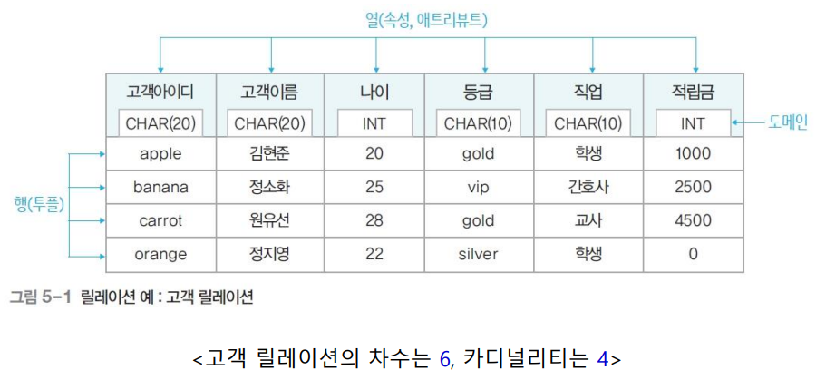

# 05. 관계 데이터 모델

### 관계 데이터 모델의 기본 개념

- 개념적 구조를 논리적 구조로 표현하는 논리적 데이터 모델
- 하나의 개체에 관한 데이터를 하나의 릴레이션에 저장

### 관계 데이터 모델의 기본 용어

- **릴레이션(relation)**
    - 하나의 개체에 관한 데이터를 2차원 테이블의 구조로 저장한 것
    - 파일 관리 시스템 관점에서 파일에 대응
- **속성(attribute)**
    - 릴레이션의 열
    - 파일 관리 시스템 관점에서 필드에 대응
- **투플(tuple)**
    - 릴레이션의 행
    - 파일 관리 시스템 관점에서 레코드에 대응
- **도메인(domain)**
    - 하나의 속성이 가질 수 있는 모든 값의 집합
        - Integer, Varchar(20) 등 과 같이 값이 가질 수 있는 범위 및 집합
    - 속성 값을 입력 및 수정할 때 적합성 판단의 기준이 됨
    - 일반적으로 속성의 특성을 고려한 데이터 타입으로 정의
- **차수(degree)**
    - 하나의 릴레이션에서 속성의 전체 개수
- **카디널리티(cardinality)**
    - 하나의 릴레이션에서 투플의 전체 개수

- **릴레이션 스키마**
    - 릴레이션의 논리적 구조
    - 릴레이션의 이름과 릴레이션에 포함된 모든 속성의 이름으로 정의
        - `고객(고객아이디, 고객이름, 나이, 등급, 직업, 적립금)`
    - **데이터베이스 스키마**: 데이터베이스를 구성하는 릴레이션 스키마의 모음
- **릴레이션 인스턴스**
    - 어느 한 시점에 릴레이션에 존재하는 투플들의 집합
    - **데이터베이스 인스턴스**: 데이터베이스를 구성하는 릴레이션 인스턴스의 모음
    
    
    

### **릴레이션의 특성**

- 투플의 유일성
    - 하나의 릴레이션에는 동일한 투플이 존재할 수 없음
        - 투플을 유일하기 구별하기 위해 선정하는 속성의 값으로 판단. 투플을 구분하기 위한 unique한 key가 필요
- 투플의 무순서
    - 하나의 릴레이션에서 투플 사이의 순서는 무의미
- 속성의 무순서
    - 하나의 릴레이션에서 속성 사이의 순서는 무의미
- 속성의 원자성
    - 속성 값으로 원자 값만 사용할 수 있음

### 키(key)의 특성과 종류

- 릴레이션에서 투플들을 유일하게 구별하는 속성 또는 속성들의 집합
- **키의 특성**
    - **유일성(uniqueness)**
        - 하나의 릴레이션에서 모든 투플은 서로 다른 키 값을 가져야 함
    - **최소성(minimality)**
        - 꼭 필요한 최소한의 속성들로만 키를 구성함
- **키의 종류**
    - **슈퍼키(super key)**
        - **유일성을 만족**하는 속성 또는 속성들의 집합
    - **후보키(candidate key)**
        - **유일성과 최소성을 만족**하는 속성 또는 속성들의 집합
    - **기본키(primary key)**
        - 후보키 중에서 기본적으로 사용하기 위해 선택한 키
    - **대체키(alternate key)**
        - 후보키 중에서 기본키로 선택되지 못한 후보키
    - **외래키(foreign key)**
        - 다른 릴레이션의 기본키를 참조하는 속성 또는 속성들의 집합
            - 하나의 릴레이션에는 외래키가 여러 개 존재할 수도 있고, 외래키를 기본키로 사용할 수도 있음
            - 자기 릴레이션의 기본키를 참조하는 외래키도 정의할 수 있음. 외래키 속성은 NULL 값을 가질 수도 있음
            - 참조하는 릴레이션: 외래키를 가진 릴레이션
            - 참조되는 릴레이션: 외래키가 참조하는 기본키를 가진 릴레이션
        
        
        

### 관계 데이터 모델의 제약

- **무결성 제약조건(integrity constraint)**
    - 데이터의 무결성을 보장하고 일관된 상태로 유지하기 위한 규칙
        - 무결성: 데이터에 결함이 없는 상태, 즉 데이터가 정확하고 유효하게 유지된 상태
    - **개체 무결성 제약조건(entity integrity constraint)**
        - 기본키를 구성하는 모든 속성은 널 값을 가질 수 없음
    - **참조 무결성 제약조건(referential integrity constraint)**
        - 외래키는 참조할 수 없는 값을 가질 수 없음
            - 즉, 참조하는 릴레이션의 기본키가 가지지 않는 값은 가질 수 없음
        - 외래키 속성은 널 값을 가질 수 있음(참조 무결성 제약조건을 위반한 것 아님)