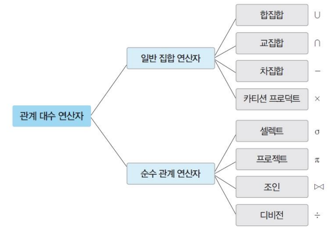

# 06. 관계 데이터 연산

### 관계 데이터 연산

- 관계 데이터 모델의 연산
- 원하는 데이터를 얻기 위해 릴레이션에 필요한 처리 요구를 수행하는 것
- 관계 대수와 관계 해석
    - **관계 대수**
        - 원하는 결과를 얻기 위해 데이터의 처리 과정을 순서대로 기술
    - **관계 해석**
        - 원하는 결과를 얻기 위해 처리를 원하는 데이터가 무엇인지만 기술
    - 데이터 언어의 유용성을 검증하는 기준의 역할 수행
        - 관계 대수나 관계 해석으로 기술할 수 있는 모든 질의를 기술할 수 있는 데이터 언어를 관계적으로 완전하다고 판단함

### 관계 대수

- 절차 언어
    - 원하는 결과를 얻기 위해 릴레이션의 처리 과정을 순서대로 기술하는 언어
- 릴레이션을 처리하는 연산자들의 모임
    - 대표 연산자 8개
    - 일반 집합 연산자와 순수 관계 연산자로 분류
- 폐쇄 특성
    - 피연산자도 릴레이션, 연산의 결과도 릴레이션

### 관계 대수 - 일반 집합 연산자

- 릴레이션이 투플의 집합이라는 개념을 이용하는 연산자
- 피연산자가 2개 필요
    - 2개의 릴레이션을 대상으로 연산 수행
- 합집합, 교집합, 차집합은 피연산자인 두 릴레이션이 **합병 가능**해야 함
    - 합병 가능 조건
        - 두 릴레이션의 **차수가 같아야 함**
        - 두 릴레이션에서 서로 **대응되는 속성의 도메인(type)이 같아야 함**
- **합집합**
    - `**R∪S**`
    - 릴레이션 R에 속하거나 릴레이션 S에 속하는 모든 투플로 결과 릴레이션 구성
    - 결과 릴레이션
        - 차수: 릴레이션 R과 S의 차수와 같음
        - 카디널리티: 릴레이션 R과 S의 카디널리티의 합보다 작거나 같음
            - 중복되는 투플은 한번만 나타나므로
    - 교환적, 결합적 특징 있음
- **교집합**
    - `**R∩S**`
    - 릴레이션 R과 S에 공통으로 속하는 투플로 결과 릴레이션 구성
    - 결과 릴레이션
        - 차수: 릴레이션 R과 S의 차수와 같음
        - 카디널리티: 릴레이션 R과 S의 어떤 카디널리티보다 작거나 같음
    - 교환적, 결합적 특징 있음
- **차집합**
    - `**R–S**`
    - 릴레이션 R에는 존재하지만, S에는 존재하지 않는 투플로 결과 릴레이션 구성
        - 릴레이션 R에서 릴레이션 S에도 속하는 투플들을 제거
    - 결과 릴레이션
        - 차수: 릴레이션 R과 S의 차수와 같음
        - 카디널리티
            - R-S의 카디널리티는 릴레이션 R의 카디널리티보다 작거나 같음
            - S-R의 카디널리티는 릴레이션 S의 카디널리티보다 작거나 같음
        - 교환적, 결합적 특징이 없음
- **카티션 프로덕트**
    - `**RXS**`
    - 릴레이션 R에 속한 각 투플과 릴레이션 S에 속한 각 투플을 모두 연결하여 만들어진 새로운 투플로 결과 릴레이션을 구성
    - 결과 릴레이션
        - 차수: 릴레이션 R과 S의 차수를 더한 것과 같음
        - 카디널리티: 릴레이션 R과 S의 카디널리티를 곱한 것과 같음
    - 교환적, 결합적 특징이 있음

### 관계 대수 - 순수 관계 연산자

- 릴레이션의 구조와 특성을 이용하는 연산자
- **셀렉트(select)**
    - 수학적 표현: `**σ조건식(릴레이션)**`
    - 데이터 언어적 표현: `**릴레이션 where 조건식**`
    - 릴레이션에서 조건을 만족하는 투플만 선택하여 결과 릴레이션을 구성
        - 수평적 연산자: 결과 릴레이션은 연산 대상 릴레이션의 수평적 부분집합
            - 결과 릴레이션은 원본 릴레이션의 투플(행)들의 부분집합
            
            
            
        - 조건식은 비교 연산자와 논리 연산자를 이용해 작성
            - 비교 연산자: (>, ≥, <, ≤, =, ≠)
            - 논리 연산자: (∧, ∨, ¬)
                - 순서대로 and, or, not
    - 교환적 특징이 있음
        
        
        
    - 예제)
        - 고객 릴레이션에서 등급이 gold이고, 적립금이 2000 이상인 투플 검색
            
            
            
- **프로젝트(project)**
    - 수학적 표현: `**𝜋속성리스트(릴레이션)**`
    - 데이터 언어적 표현: `**릴레이션[속성리스트]**`
    - 릴레이션에서 선택한 속성의 값으로 결과 릴레이션을 구성
        - 수직적 연산자: 결과 릴레이션은 연산 대상 릴레이션의 수직적 부분집합
            - 결과 릴레이션은 원본 릴레이션의 속성(열)들의 부분집합
            
            
            
    - 예제)
        - 고객 릴레이션에서 고객이름, 등급, 적립금 검색
            
            
            
- **조인(join)**
    - 표현법: `**릴레이션1 ⋈ 릴레이션2**`
    - 조인 속성을 이용해 두 릴레이션을 조합하여 결과 릴레이션을 구성
        - 조인 속성: 두 릴레이션이 공통으로 가지고 있는 속성
    - 조인 속성이 같은 투플만 연결하여 생성된 투플을 결과 릴레이션에 포함
        - 조인 속성이 여러개인 경우, 해당 조인 속성이 모두 같은 투플들만 연결함
            
            
            
    - **세타 조인**
        - 표현법: `**릴레이션1 ⋈A𝜃B 릴레이션2**`
            - 이때 𝜽는 비교 연산자(>, ≥, <, ≤, =, ≠)를 의미
        - 동등 조인에 비해 더 일반화된 조인
        - 주어진 조인 조건을 만족하는 두 릴레이션의 모든 투플을 연결하여 생성된 새로운 투플로 결과 릴레이션을 구성
        - 결과 릴레이션의 차수는 두 릴레이션의 차수를 더한 것과 같음
    - **동등 조인**
        - 표현법: `**릴레이션1 ⋈A=B 릴레이션2**`
        - 𝜽 연산자가 “=”인 세타 조인을 의미
    - **자연 조인**
        - 표현법: `**릴레이션1 ⋈N 릴레이션2**`
        - 동등 조인의 결과 릴레이션에서 조인 속성이 한 번만 나타나게 하는 연산
            - 양 릴레이션에 조인 속성이 각각 하나씩 존재하므로, 동등 조인 결과 릴레이션에는 중복된 조인 속성이 있음
            - 자연조인은 이 중복된 조인 속성을 제거하여 한 번만 나타나게 한 것
- **디비전(division)**
    - 표현법: `릴레이션1 ÷ 릴레이션2`
    - 릴레이션2의 모든 투플과 관련이 있는 릴레이션1의 투플로 결과 릴레이션을 구성
        - 단, 릴레이션1이 릴레이션2의 모든 속성을 포함하고 있어야(도메인이 같아야) 연산이 가능함
    - 릴레이션 R의 속성이 S의 속성값을 모두 가진 튜플에서 S가 가진 속성을 제외한 속성만을 구하는 연산
        
        
        
    

### 확장된 관계 대수 연산자

- **세미 조인**
    - 표현법: `릴레이션1 ⋉ 릴레이션2`
    - 조인 속성으로 프로젝트 연산을 수행한 릴레이션을 이용하는 조인
    - 릴레이션2를 조인 속성으로 프로젝트 연산한 후, 릴레이션1에 자연조인하여 결과 릴레이션 구성
        
        
        
    - 불필요한 속성을 미리 제거하여 조인 연산 비용을 줄일 수 있음
    - 교환적 특징이 없음
- **외부 조인**
    - 자연 조인 연산에서 제외되는 투플도 결과 릴레이션에 포함시키는 조인
        - 결과 릴레이션에서 속성 값이 없는 경우는 널 값으로 처리
    - 모든 투플을 결과 릴레이션으로 가져오는 릴레이션이 무엇이냐에 따라 왼쪽 외부조인, 오른쪽 외부 조인, 완전 외부 조인으로 나눔
        - **왼쪽 외부 조인**
            - 표현법
                
                
                
                - 왼쪽에 있는 릴레이션1에 존재하는 모든 투플을 결과 릴레이션에 포함시킴
                    
                    
                    
        - **오른쪽 외부 조인**
            - 표현법
                
                
                
                - 오른쪽에 있는 릴레이션2에 존재하는 모든 투플을 결과 릴레이션에 포함시킴
        - **완전 외부 조인**
            - 표현법
                
                
                
                - 두 릴레이션에 있는 모든 투플을 결과 릴레이션에 포함시킴
                    
                    
                    
                    
                    
        

### 관계 해석

- 처리를 원하는 데이터가 무엇인지만 기술하는 언어
    - 비절차 언어
- 기능과 표현력 측면에서 관계 대수와 동등한 능력을 가짐
- 분류
    - 투플 관계 해석
    - 도메인 관계 해석